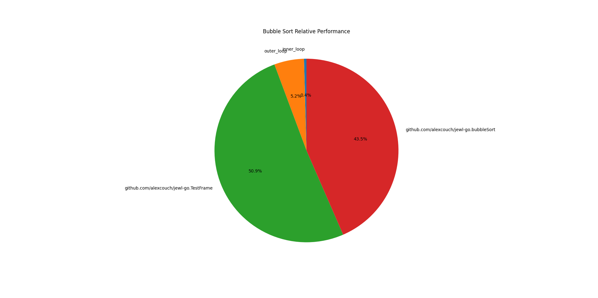
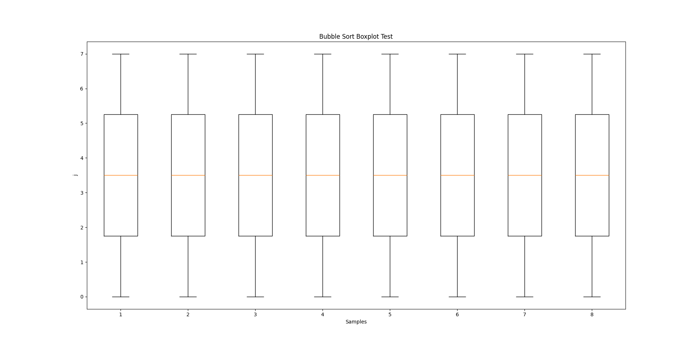

# Jewl

[](https://github.com/alexcouch/Jewl.jl/actions/workflows/CI.yml?query=branch%3Amain)

A julia powered debug tool that allows the use of data science to debug your application.

## How to Use 
In your julia prompt, install this git repo
```julia
(@v1.9) pkg> add https://github.com/AlexCouch/Jewl.jl.git 
```
Then, in your project, after producing the `dump.json` file, run the following code:
```julia-repl
julia> data_name = Jewl.Load("dump.json")
julia> perfdata = Jewl.Performance(data_name)
julia> labels, data = Jewl.RelativePerformance(perfdata)
julia> ShowPieChart(data, labels, "[Program Name] Relative Performance")
```
This produces the following pie chart 


```julia-repl
julia> data = Jewl.Load("data/bubble_sort.json")
julia> samples = Jewl.Sample(data, "outer_loop", "inner_loop", "j")
julia> using PyPlot
julia> ioff()
julia> title("Bubble Sort Boxplot Test")
julia> xlabel("Samples")
julia> ylabel("j")
julia> boxplot(samples)
julia> show()
```
This code produces the following box plot


For generating frames and a dump.json file, see [jewl-go](https://github.com/AlexCouch/jewl-go)

*This project is a Work-In-Progress. Library and data format is subject to change!*
